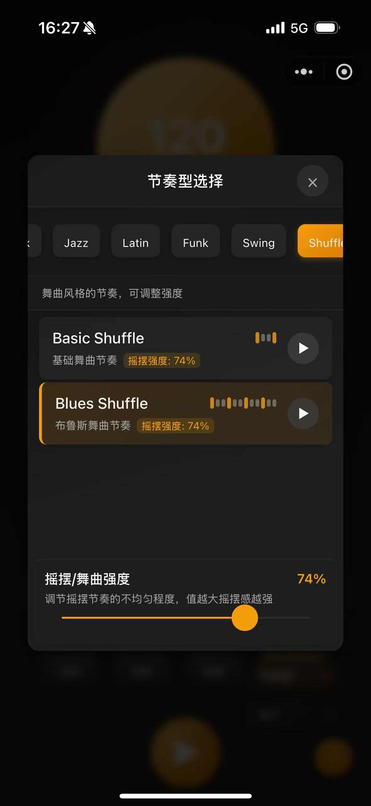
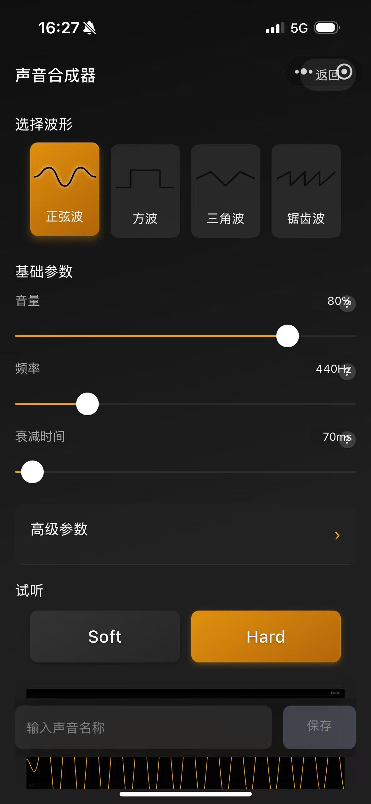
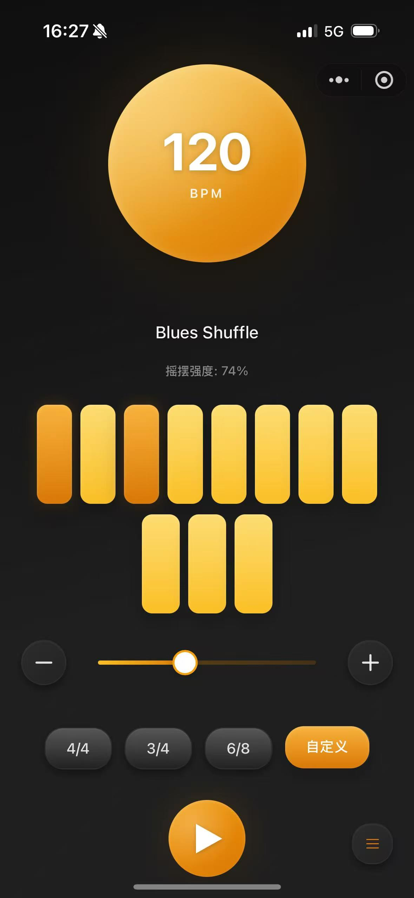

# WeBeat - 节拍器小程序

  

## 项目介绍

WeBeat 是一款专业的声音合成节拍器微信小程序，集合了节拍器功能与声音合成器于一体。它不仅提供了传统节拍器的所有功能，更具备强大的声音合成能力，让用户可以定制自己喜欢的节拍音色，创造独特的音乐体验。

### 主要功能

- **专业节拍器**：精确的时间控制，支持多种拍号、节奏模式、音色
- **声音合成器**：强大的波形合成引擎，可创建各种音色，实时显示音频波形和频谱分析

## 声音合成器功能

### 波形类型
- **正弦波**：纯净的基础音色
- **方波**：明亮有力的音色
- **三角波**：温和平滑的音色
- **锯齿波**：丰富明亮的音色

### 基础参数
- **音量**：控制整体响度
- **频率**：调整音高
- **衰减时间**：控制音符持续时间

### 高级参数
| 参数类型 | 功能描述 |
|---------|---------|
| 调制参数 | 频率和深度调整 |
| 包络控制 | 精确的ADSR控制（起音、衰减、持续、释放）|
| 谐波增强 | 增加波形丰富度 |
| 失谐控制 | 创造更自然的声音 |
| 滤波器  | 多种滤波器类型和参数 |
| 失真效果 | 多种失真类型和强度 |
| 立体声控制 | 位置和宽度调整 |

## 技术实现

WeBeat 使用了微信小程序的原生开发框架，结合 Web Audio API 实现了专业级的音频处理能力。

### 技术亮点
- 高精度音频定时器
- 实时波形绘制和频谱分析
- 傅立叶变换实现波形合成
- 参数化音频处理链
- 滑动参数实时预览
- 高性能绘图优化

## 使用指南

### 节拍器使用
1. 设置拍号、速度和节奏模式
2. 选择内置音色或自定义音色
3. 点击开始按钮开始计拍

### 声音合成器使用
1. 选择基础波形
2. 调整基础参数（音量、频率、衰减时间）
3. 展开高级参数进行细节调整
4. 试听效果（Soft/Hard 按钮）
5. 为音色命名并保存

## 界面预览

  
  
  

